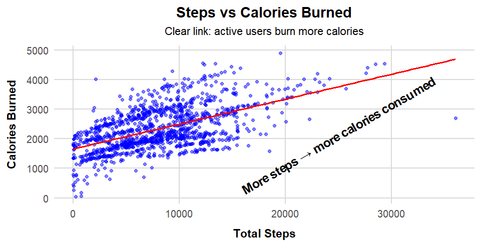
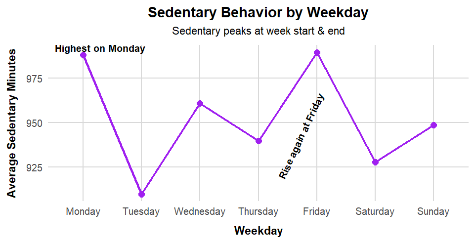
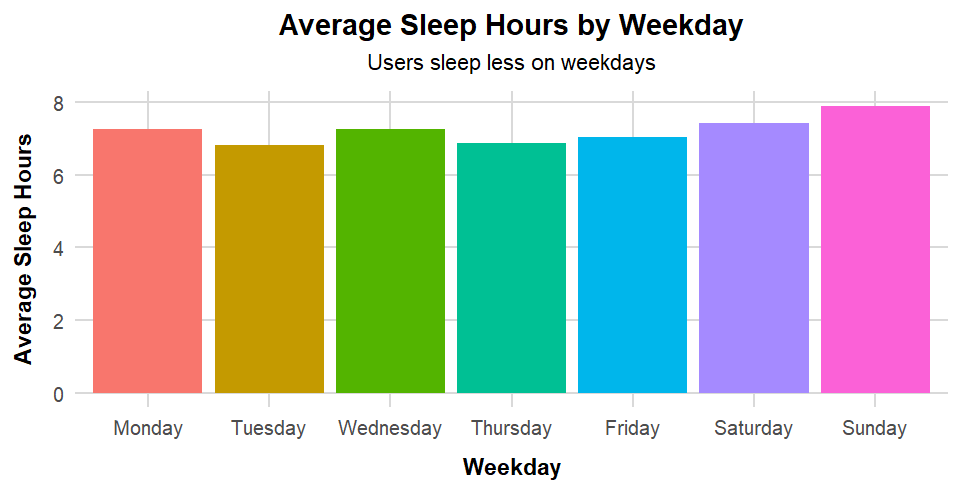
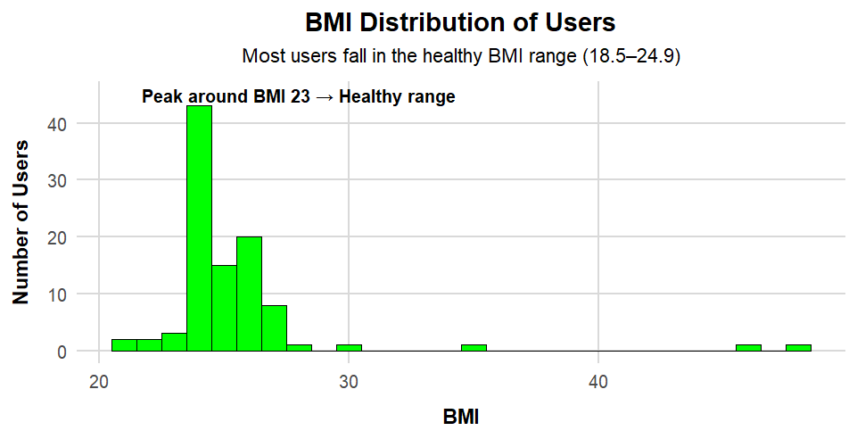
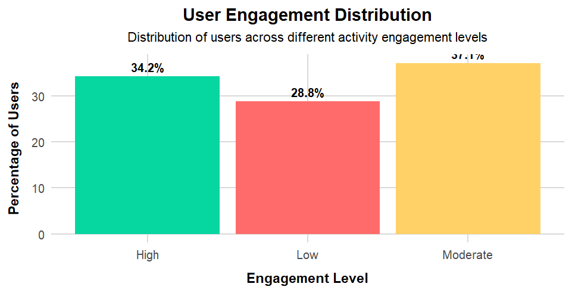

# Bellabeat Wellness Analysis  

## Overview  
This project is part of the **Google Data Analytics Professional Certificate Capstone**.  

The objective is to analyze **Bellabeat’s wellness data** to understand user patterns in activity, sleep, weight, and heart rate. These insights are then used to recommend strategies that can enhance user engagement and support Bellabeat’s growth as a holistic wellness brand.  

---

## Business Task  
Design **data-driven product and marketing strategies** to increase user engagement by:  
- Identifying behavioral patterns in activity, sleep, and health metrics.  
- Understanding differences between highly active and less active users.  
- Supporting recommendations with visual evidence and measurable insights.  

---

## 📂 Datasets

All datasets used in this analysis are hosted on Kaggle (due to GitHub's 25 MB per-file limit).

- **Raw Datasets (March to April)**  
  Contains 3 raw CSV files collected from March 12 to April 11.  
  [View on Kaggle](https://www.kaggle.com/datasets/hamzajawad123/march-12-to-april-11-raw-datasets)

- **Raw Datasets (April to May)**  
  Contains 4 raw CSV files collected from April 12 to May 11.  
  [View on Kaggle](https://www.kaggle.com/datasets/hamzajawad123/april-12-to-may-11-datasets)

- **Clean and Merged Final Datasets**  
  Contains 4 cleaned and merged CSV files used for the analysis.  
  [View on Kaggle](https://www.kaggle.com/datasets/hamzajawad123/fitbit-cleaned-and-merged-datasets)

  
---

## Process  
The analysis followed the **six-step data analysis framework**:  

1. **Ask** – Define the problem: “How do Bellabeat users engage with their wellness data across activity, sleep, and health?”  
2. **Prepare** – Collect and merge daily activity, sleep, weight, and heart rate datasets.  
3. **Process** – Clean data (remove duplicates, fix missing values, standardize formats).  
4. **Analyze** – Explore trends in steps, calories, sleep duration, BMI, and heart rate.  
5. **Share** – Create clear visualizations and summaries to communicate patterns.  
6. **Act** – Suggest strategies to improve user engagement and product positioning.  

---

## Key Insights  
- **Activity**: Highly active users walk ~13,000 steps daily vs. ~2,500 for less active users. More steps strongly correlate with more calories burned (r = 0.56).  
- **Sedentary Patterns**: Sitting time is highest on Mondays and Fridays, and lowest on Tuesdays, showing clear weekday effects.  
- **Sleep**: Average sleep is 7.2 hours with high quality (91% efficiency). Users sleep more on weekends and less on workdays.  
- **Weight & BMI**: Average BMI is 25.4 (borderline healthy). About 64% of users log weight manually, showing proactive health tracking.  
- **Heart Rate**: Average daily heart rate is 79 bpm. Ranges show both casual and fitness-focused users.  
- **Activity vs Sleep**: Slight negative correlation (r = -0.28) — more activity does not always mean more sleep.  

---

## Tech Stack  
  
  
  

---

## Deliverables  
- [Bellabeat Analysis Report (HTML)](./deliverables/bellabeat_analysis_report.html)  
- [PowerPoint Presentation](./deliverables/Bellabeat_Analysis_slides.pptx)  
- [Data Cleaning Script (R)](./scripts/bellabeat_analysis_cleaning.R)  

---

## 📊 Sample Visualizations  

Here are a few key visualizations generated during the analysis:  

**Visualization 1: Steps vs Calories Burned**  
This scatter plot shows a clear positive relationship between **daily steps** and **calories burned**, indicating that more active users burn more calories.  
  

---

**Visualization 2: Sedentary Behavior by Weekday**  
This line chart illustrates **average sedentary minutes** across the week, showing that users are most sedentary on **Mondays** and again near the **end of the week**.  
  

---

**Visualization 3: Average Sleep Hours by Weekday**  
This bar chart displays **average sleep duration** on different weekdays, showing that users sleep less on **weekdays** compared to **weekends**.  
  

---

**Visualization 4: BMI Distribution of Users**  
This histogram shows the **distribution of BMI values** among users, with most users falling in the **healthy range (18.5–24.9)**.  
  

---

**Visualization 5: User Engagement Levels**  
This bar chart shows the **percentage of users** in each engagement category (Low, Moderate, High), providing an overview of overall user activity.  
  

---

## Recommendations  
1. Launch **weekday activity challenges** to counter high sedentary time.  
2. Promote **Bellabeat as a sleep and stress management guide** alongside activity tracking.  
3. Introduce **auto-weight logging features** to reduce manual effort.  
4. Position Bellabeat as a **holistic wellness brand** focusing on activity, sleep, heart, and weight tracking.  

---

## About This Project  
This case study demonstrates **real-world data analytics skills** including:  
- Data cleaning and wrangling  
- Exploratory and statistical analysis  
- Data visualization  
- Business storytelling  
- Actionable recommendations  

---

## Acknowledgements  
- Data adapted from **Fitbit wellness tracker datasets** shared under public use.  
- Case study inspired by the **Google Data Analytics Professional Certificate**.  

---
